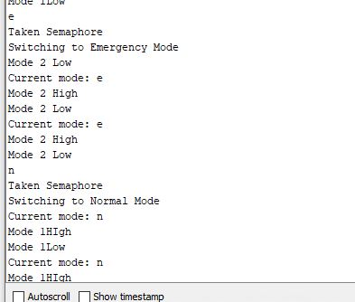

## Operation
This code can be used to switch between modes in FreeRTOS.
Each mode can have several tasks attached to it. 
In this example, we have a normal and an emergency mode.
Both have a single dummy task that just prints the current mode and some text

Writing to serial is used as an interrupt that causes mode switch.
There is also a mode switching task whose job is to start,suspend or resume tasks as required.
We use a binary semaphore to signal to this mode switching task that we want to switch modes.

   
For instance, by default we are in normal mode.
If an e character is entered, we set a variable next_mode to e. This means that we want to switch to emergency.
We then give a binary semaphore.

The mode switching task is always waiting for this semaphore. Once the semaphore is given, it takes it and then suspends all the tasks from normal mode. It then starts or resumes emergency mode tasks.
Similar case for going to normal mode.

## Output
