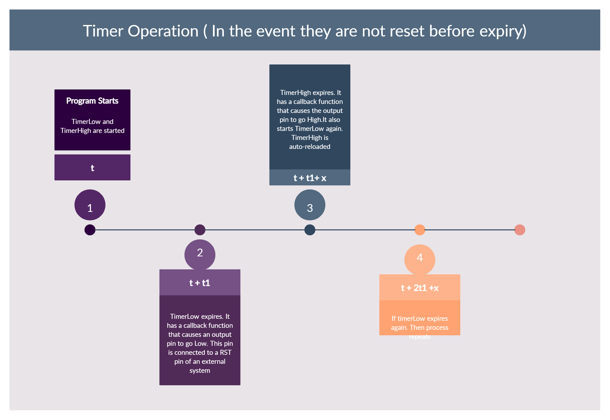

## This causes a reset operation in an external system

## Operation

Causing a Reset is usually system dependent. However, in this case, we need to write a digitalLow Output to the Reset Pin of the system. After some time, usually a minimum of several microseconds, we write a digitalHIGH.
They are two timers. TimerLow and TimerHigh.
TimerLow has a timeout time t1
TimerHigh has a timeout time t1+x which is dependent on the system you want to reset
Essentially, if we receive some interrupt from system B, we reset the timers and thus the reset operation is not caused.
However, if we don't receive an interrupt within t1 milliseconds, timerLow times out first. It has a callback function attached to it that causes an output pin to go Low.
After some time x, timerHigh then times out. It has a callback function attached to it that causes an output pin to go High. For consistency, this callback function also resets timerLow.

TimerHigh is on autoreload.
TimerLow is one shot.
This is to ensure that incase they timeout, timerLow is started by the timerHigh callback. Thus ensuring that the time x between them is consistent.

### Interrupt
Writing to serial is used as an interrupt that resets the timers before they expire.
However,any interrupt can be used.

## Timing Diagram
